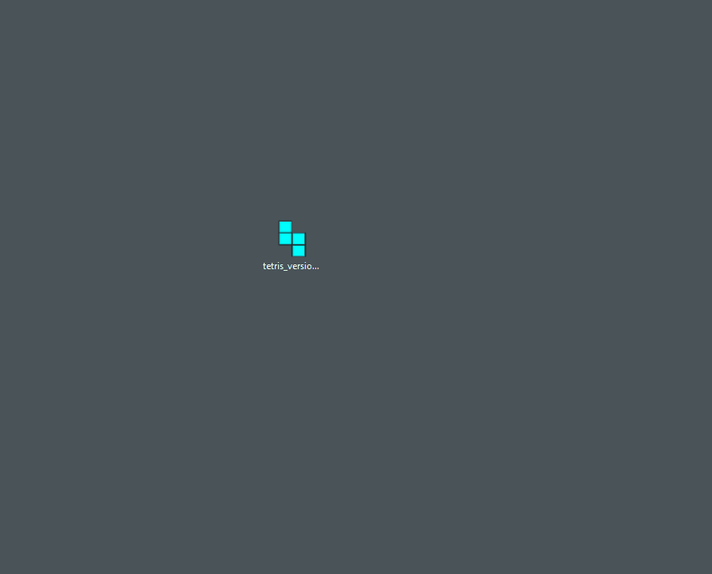

# Tetris Clone Project



# About

### What is this project ?
* This is a very basic tetris game; developed from scratch to learn, experience and share.

### Let me try
* There is a build version on [release page](https://github.com/taner1es/Tetris/releases), still you can create your own build.

### Features
* Generic tetris mechanics.
* Highscore system.
* Music & sound effects.
  
# Build
#### Prerequisites

* [Oracle JDK 9.0.4](https://www.oracle.com/java/technologies/javase/javase9-archive-downloads.html#license-lightbox); previous or later versions may work, not tested.
* Update PATH environment variable. [help!](https://docs.oracle.com/javase/8/docs/technotes/guides/install/windows_jdk_install.html#BABGDJFH)

#### Windows

```
mkdir C:\cloned-projects\Tetris
git clone https://github.com/taner1es/Tetris.git C:\cloned-projects\Tetris
cd C:\cloned-projects\Tetris\Tetris\src\tetris\code\
javac -cp ../../ Tetris.java
java -cp ../../ tetris.code.Tetris 
```

#### Linux
```
```

#### Mac
```
```

# License

This project is licensed under the GNU General Public License v3.0 - see the [LICENSE.md](LICENSE) file for details
